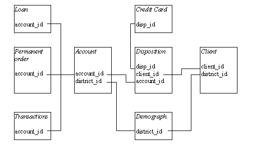
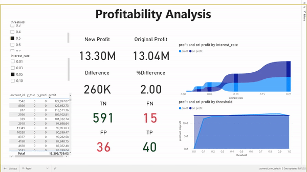

# loan-default-prediction
Loan default prediction with Berka Dataset

## Goal
To provides mechanisms in determining which consumers should receive loans and to benefit banks in increasing profits.

## Dataset
We use [Berka dataset](https://relational.fit.cvut.cz/dataset/Financial) or PKDD'99 Financial dataset which contains 606 successful and 76 not successful loans along with their information and transactions.
the data relation is shown below.

# Experiments
* we've tried several model which are LGBM, RandomForest, and XGboost (we used auto ML and found that these models are best)
in the last, we use **XGboost** with feature selection (using important) and Gridserch to tuning hyperparameters because its give best performance
* we calculate profit by using profit = revenue - cost which revenue is from money the bank get from interest and cost is defaulted money. the more information is in `profit_analysis.ipynb`

## How to run
* First, preprocess the raw data run `data_manipulation.ipynb`. The rusult will be in `transformed_data/final_transformed_data.csv`
* second, train model using `model.ipynb`. The results will be in `report/report_xgb.csv` which contains true label and probability of prediction in each account
* then, we run `profit_analysis.ipynb` to create `report/ori_profit.csv` which is the original profit, and the final result `report/report_xgb_threshold_profit.csv` which is the profit after using this model in each threshold and each interest rate

## Results
### performance results 
* inital model performance 
| **model**              | Acc   | F1    | ROC_AUC | \
|------------------------|-------|-------|---------| \
| LGBMClassifier         | 0.925 | 0.553 | 0.743   | \
| RandomForestClassifier | 0.924 | 0.544 | 0.764   | \
| XGBClassifier          | 0.923 | 0.596 | 0.738   | \

* Performance after using best params & best feature
| **model**              | Acc   | F1    | ROC_AUC |   |
|------------------------|-------|-------|---------|---|
| LGBMClassifier         | 0.919 | 0.572 | 0.731   |   |
| RandomForestClassifier | 0.912 | 0.616 | 0.791   |   |
| XGBClassifier          | 0.927 | 0.645 | 0.784   |   |

### Power BI Visualization
we use Power BI to create a interactive dashboard to visualize the profit we've made

# Links
[Power BI dashboard](https://app.powerbi.com/view?r=eyJrIjoiZjAzNzBiODItMjFiMC00N2RhLWJlNzQtOTRhNTUzZDliNDkzIiwidCI6IjZmNDQzMmRjLTIwZDItNDQxZC1iMWRiLWFjMzM4MGJhNjMzZCIsImMiOjEwfQ%3D%3D&pageName=ReportSectionf57bff23ee235c96e001)
[Slide presentation](https://www.canva.com/design/DAFA2LPDvU0/Ic6zbqoEjrfDSmRpghyBgw/view?utm_content=DAFA2LPDvU0&utm_campaign=designshare&utm_medium=link2&utm_source=sharebutton)

